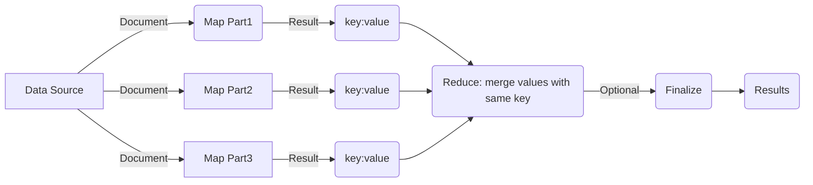

<!-- START doctoc generated TOC please keep comment here to allow auto update -->
<!-- DON'T EDIT THIS SECTION, INSTEAD RE-RUN doctoc TO UPDATE -->
**Table of Contents**  *generated with [DocToc](https://github.com/thlorenz/doctoc)*

- [简介](#%E7%AE%80%E4%BB%8B)
- [MongoDB聚合框架](#mongodb%E8%81%9A%E5%90%88%E6%A1%86%E6%9E%B6)
  - [Map-Reduce](#map-reduce)
- [利用SpringData进行聚合操作](#%E5%88%A9%E7%94%A8springdata%E8%BF%9B%E8%A1%8C%E8%81%9A%E5%90%88%E6%93%8D%E4%BD%9C)
  - [基本抽象](#%E5%9F%BA%E6%9C%AC%E6%8A%BD%E8%B1%A1)
  - [Aggregation](#aggregation)
  - [AggregationOperations](#aggregationoperations)
    - [概览](#%E6%A6%82%E8%A7%88)
- [Example](#example)
- [REFERENCES](#references)

<!-- END doctoc generated TOC please keep comment here to allow auto update -->


## 简介

之前一直用Java Stream来处理数据聚合操作，统计一些前端需要的信息，虽然一直没什么大问题，但是总觉的这事饶了一大圈，苦于不熟悉SpringData和MongoDB，对于MongoDB的聚合框架更是一无所知，索性和SpringData MongoDB一起，趁这个机会给自己扫个盲。

要理解SpringData mongo中的聚合框架，首先需要了解一下Mongodb中的聚合框架是如何定义，如何使用的，因为说到底，SpringData提供的聚合框架支持，最后都会转化为数据库本身的聚合框架所能理解的形式，并交由数据库本身执行。

## MongoDB聚合框架

MongoDB自身提供三种形式的聚合操作：管道聚合、Map-Reduce模式和单目标聚合操作，其中管道聚合和Map-Reduce拥有比较高的灵活性，单目标聚合操作限于一些特定目标的聚合，无法满足其他定制化需求。

根据官方文档的说法，Map-Reduce模式是通过JavaScript函数来定义行为的，这就意味着，虽然给行为的定义增加了极大的灵活性，但是也同时意味着性能损耗。（还要学JavaScript，混在后端代码里总觉得怪怪的）

> Starting in MongoDB 2.4, certain [`mongo`](https://docs.mongodb.com/manual/reference/program/mongo/#bin.mongo) shell functions and properties are inaccessible in map-reduce operations. MongoDB 2.4 also provides support for multiple JavaScript operations to run at the same time. Before MongoDB 2.4, JavaScript code executed in a single thread, raising concurrency issues for map-reduce.

### Map-Reduce

Map-Reduce模式相信接触过Hadoop都很容易理解。



> For most aggregation operations, the [Aggregation Pipeline](https://docs.mongodb.com/manual/core/aggregation-pipeline/) provides better performance and more coherent interface. However, map-reduce operations provide some flexibility that is not presently available in the aggregation pipeline.

[参考Doc](https://docs.mongodb.com/manual/reference/command/mapReduce/#dbcmd.mapReduce)


## 利用SpringData进行聚合操作

### 基本抽象

Spring Data MongoDB提供了几个非常关键的基本抽象：

* `Aggregation`
* `AggregationOperation`
* `AggregationExpression`
* `AggregationResults`

这四个抽象中，`Aggregation`是最上层的抽象，它由一系列的`AggregationOperation`来定义，说的具体一点，`Aggregation`定义了一个管道，而管道中的各种操作由`AggregationOperation`来定义。`AggregationOperation`一般会对输出的文档结构产生变化。`AggregationExpression`是更加基础微小的操作，一般作用于文档的某个字段，比如类型转换，类似于Java Stream中的各种匿名函数（方法参数）。而`AggregationResult`实际上是将MongoDB返回的操作结果映射成Java定义的数据对象结构。

一个官方提供的伪代码示例：

```java
import static org.springframework.data.mongodb.core.aggregation.Aggregation.*;

Aggregation agg = newAggregation(
    pipelineOP1(), //AggregationOperation
    pipelineOP2(),
    pipelineOPn()
);

AggregationResults<OutputType> results = mongoTemplate.aggregate(agg, "INPUT_COLLECTION_NAME", OutputType.class);
List<OutputType> mappedResult = results.getMappedResults();
```

上述代码中，由一组`AggregationOperation`操作定义的`Aggregation`对象，通过`MongoTemplate`交由MongoDB执行，其结果通过`AggregationResults`转换成需要的对象结构`OutputType`。由此完成一个完成的聚合过程。

所以，可以根据业务自定义组合的`AggregationOperation`是应该被重点关注的。

### Aggregation

`Aggregation`对象只能通过其定义的静态方法来构造。首先看一看`Aggregation`有几种构造方法：

> 所有源码取自 SpringData MongoDB 2.1.5.RELEASE (Current GA版本)

```java
/*
 * 数组初始化方法
 */
public static Aggregation newAggregation(AggregationOperation... operations) {
		return new Aggregation(operations);
}

/*
 * 列表初始化方法，实际上还是转换成数组，调用的数组初始化方法
 */
public static Aggregation newAggregation(List<? extends AggregationOperation> operations) {
    return newAggregation((AggregationOperation[])operations.toArray(new AggregationOperation[operations.size()]));
}

/*
 * 比第一个初始化方法多一个 type 参数，返回一个TypedAggregation，是Aggregation的子类。
 */
public static <T> TypedAggregation<T> newAggregation(Class<T> type, AggregationOperation... operations) {
    return new TypedAggregation(type, operations);
}

/*
 * 列表初始化方法
 */
public static <T> TypedAggregation<T> newAggregation(Class<T> type, List<? extends AggregationOperation> operations) {
    return newAggregation(type, (AggregationOperation[])operations.toArray(new AggregationOperation[operations.size()]));
}
```

静态构造函数提供了两套方法，分别返回`Aggregation`和`TypedAggregation`对象，子类`TypedAggregation`相比于其父类`Aggregation`差异非常小，主要不同在于子类多了一个私有变量`private final Class<I> inputType;` 以及配套的构造方法。(`Aggregation`的构造方法是从List最终转化成数组进行初始化，而`TypedAggregation`恰好相反，最终转化成List进行初始化...)。

### AggregationOperations

#### 概览

 SpringData MongoDB 2.1.5.RELEASE提供了对如下聚合管道操作的支持：MongoDB 版本4.0

| Stages in MongoDB | Operations in SpringData MongoDB | 描述                                                         |
| ----------------- | -------------------------------- | ------------------------------------------------------------ |
| `$addFields`      |                                  | 为每个Document增加一个字段，最后输出包括Document中本身的字段以及新增的字段。 |
| `$bucket`         | `BucketOperation`                | *New in version 3.4.* 分桶存放，将Documents按照groupBy得到的值分类到特定的桶中，超过桶范围的Document会被计入一个特殊的`default`桶里。 |
| `$bucketAuto`     | `BucketAutoOperation`            | *New in version 3.4.* 自动分桶存放，均匀分配到指定数量的桶里 |
| `$collStats`      |                                  | *New in version 3.4.* 获取Collction的统计信息，请求延时、存储延时等。 |
| `$count`          | `CountOperation`                 | *New in version 3.4.* 对输入到这一步的文档计数，结果存到指定的Document字段中。 |
| `$facet`          | `FacetOperation`                 | *New in version 3.4.* 同时进行多个管道操作，比如对一个表需要统计其多个统计量，最大最小计数求和等，可以在`$facet`中同时进行，输出到Document的不同字段。 |
| `$geoNear`        | `GeoNearOperation`               | 找到某个点在2d或者3d范围内圆形或者球形范围内的Documents，这个Stage必须在所有Stage之前。 |
| `$graphLookup`    | `GraphLookupOperation`           | 传递查找，遍历所有文档，找到一组有传递关系的文档，放入一个新的字段中。 |
| `$group`          | `GroupOperation`                 | 分组聚合，将相同条件的文档按需求聚合成一个文档               |
| `$indexStats`     |                                  |                                                              |
| `$limit`          | `LimitOperation`                 | 限制此Stage的输出文档数                                      |
| `$listSessions`   |                                  |                                                              |
| `$lookUp`         | `LookUpOperation`                | 左外连接                                                     |
| `$match`          | `MatchOperation`                 | 过滤                                                         |
| `$out`            | `OutOperation`                   | 将上一阶段产生的结果放入新的Collection中                     |
| `$project`        | `ProjectionOperation`            | 字段映射，可以限制输出字段，或映射为新的字段                 |
| `$redact`         |                                  | `$project`,`$match`的合并版                                  |
| `$sample`         |                                  | 随机选取一定数量的文档                                       |
| `$skip`           | `SkipOperation`                  | 跳过一定数量的文档                                           |
| `$sort`           | `SortOperation`                  | 排序                                                         |
| `$sortByCount`    |                                  | 按groupBy后的每组包含的文档数作为依据排序                    |
| `$unwind`         | `UnwindOperation`                | 类似flatmap，将一个文档展开成多个文档                        |

很好奇为什么SpringData对MongoDB聚合框架的支持为什么不抽象成类似Stream的那种声明式方法进行链式调用？


> Tips
>
> * Using the group operations does have some limitations, for example it is not supported in a shared environment and it returns the full result set in a single BSON object, so the result should be small, less than 10,000 keys. （用group操作的局限在于其不支持共享的环境，并且其返回结果存在于一个单独的BSON对象中，小于10000个keys。）

## Example

## REFERENCES

> * [Spring-data-mongodb官方文档](https://docs.spring.io/spring-data/mongodb/docs/2.1.5.RELEASE/reference/html)
> * [Mongodb 官方文档](<https://docs.mongodb.com/manual/meta/aggregation-quick-reference/>)
